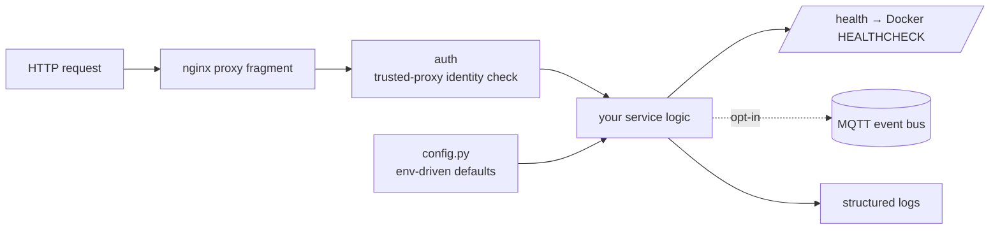

# service-template

An opinionated Python microservice template. It is the base I use for dozens of
self-hosted services. Each of them inherits the same health checks, logging and
security defaults, so I stop rebuilding that part every time.

## What it gives you
- **Config** via environment with sane defaults (`app/config.py`)
- **Health endpoint** (`/health`) wired to a Docker `HEALTHCHECK`
- **MQTT** publisher/subscriber scaffolding as an opt-in event bus
- **Auth** helper with trusted-proxy verification, so a forwarded identity
  cannot be spoofed by an untrusted peer
- **Structured logging**
- **Hardened Dockerfile** (non-root, minimal surface) plus an nginx
  reverse-proxy fragment
- `scripts/new-service.sh` to stamp out a new service from the template

## Philosophy
Stability and security come before features here, and the template stays small on
purpose. Config, auth, health and mqtt are scaffolding you switch on when you need
them. Nothing in the template forces you to keep them.

MIT licensed.

## About this snapshot

This repo sits closest to its private original, since a template has little to
hide. The publishing script still does the full pass over it: internal addresses
and paths become placeholders, and two secret scanners have to agree before
anything leaves the house.

The single commit is the same story as in my other repos here. This template is
what my own services are built on.
