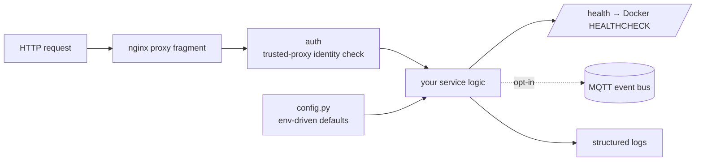

# service-template

An opinionated Python microservice template. It is the base I use for dozens of
self-hosted services, so every one of them inherits the same health,
observability and security baseline instead of reinventing it.

## What it gives you
- **Config** via environment with sane defaults (`app/config.py`)
- **Health endpoint** (`/health`) wired to a Docker `HEALTHCHECK`
- **MQTT** publisher/subscriber scaffolding as an opt-in event bus
- **Auth** helper with trusted-proxy verification, so a forwarded identity
  cannot be spoofed by an untrusted peer
- **Structured logging**
- **Hardened Dockerfile** (non-root, minimal surface) plus an nginx
  reverse-proxy fragment
- `scripts/new-service.sh` to stamp out a new service from the template

## Philosophy
Stability and security before features. The template is deliberately small. The
config, auth, health and mqtt modules are opt-in scaffolding, not framework
lock-in.

MIT licensed.

## About this snapshot

This repository is a curated, secret-free extract from a private source repository.
A script performs the extraction: it drops non-public files, rewrites internal
addresses and paths to placeholders, and requires two independent secret scanners
to pass before anything is pushed.

The development history stays private, which is why you see a single commit here
instead of the real timeline. The code itself is not a demo: it runs in my own
infrastructure and is maintained there.
